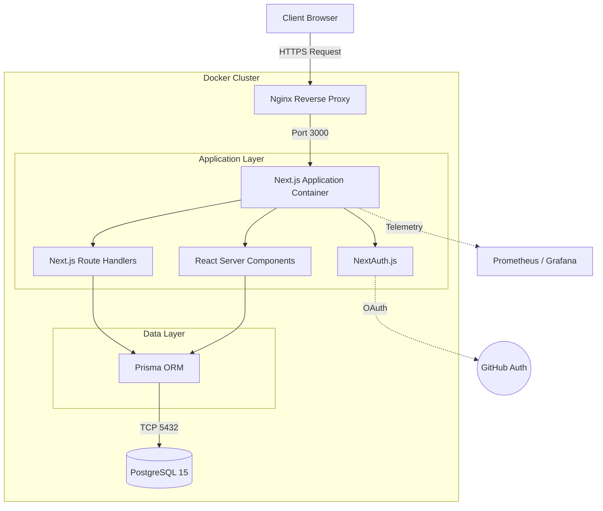
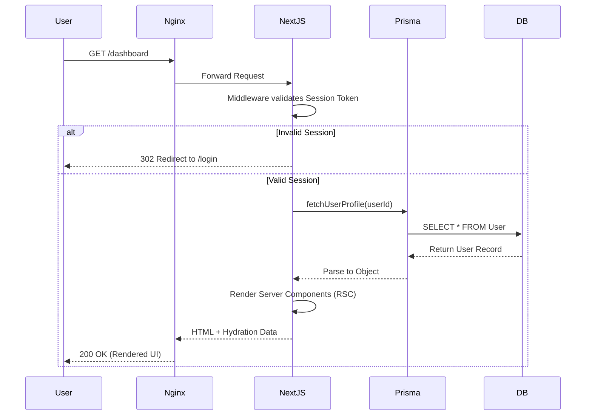
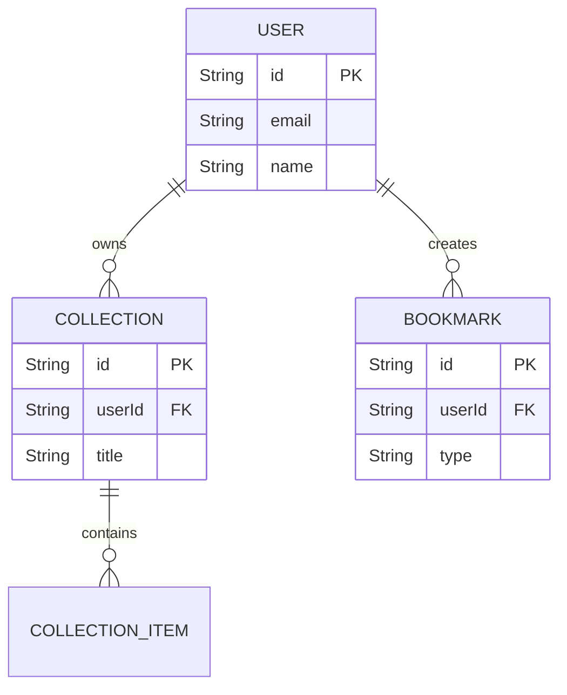

# Architecture Documentation

DevMarket employs a modern, microservices-inspired monolithic architecture built on Next.js 15 (App Router). This document details the high-level system design.

## 1. System Architecture

## 2. Request Lifecycle

## 3. Database Flow

The Data Layer strictly enforces relational integrity.

## 4. Scaling Considerations
- **Stateless Application**: Next.js is stateless, allowing horizontal scaling via Docker Swarm or Kubernetes.
- **Connection Pooling**: Prisma requires external connection pooling (like PgBouncer) for massive concurrency.
- **Edge Computing**: Middleware handles auth verification at the Edge to reduce origin server load.
