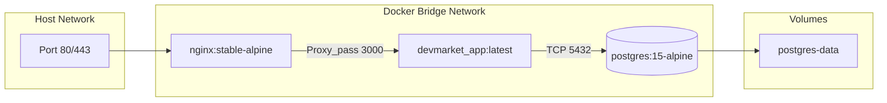

# Deployment Lifecycle

This guide covers the deployment strategy for DevMarket using Docker.

## 1. Docker Architecture

## 2. Deployment Steps
1. **Infrastructure Provisioning**: Run `terraform apply` to create the AWS VPC and EC2 instance.
2. **Environment Configuration**: SSH into the server and create a `.env` file containing secrets.
3. **Container Orchestration**: Run `docker-compose up -d --build`. This will start Nginx, Next.js, and PostgreSQL.
4. **Database Migration**: Execute `docker exec <app-container> npx prisma migrate deploy` to ensure schema parity.

## 3. Zero-Downtime Consideration
Future iterations will utilize Docker Swarm or Kubernetes Rolling Updates to ensure users never experience downtime during redeployments.
