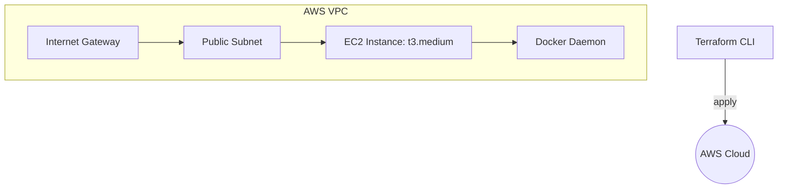

# DevOps Workflow & CI/CD Pipeline

DevMarket employs strict DevOps principles to bridge the gap between development and IT operations.

## 1. CI/CD Pipeline Architecture

```mermaid
graph TD
    Dev[Developer] -->|Git Push| GitHub[GitHub Repository]
    
    subgraph Continuous Integration (Jenkins)
        GitHub --> Action1[Lint & Format Check]
        GitHub --> Action2[TypeScript Type Check]
        GitHub --> Action3[Unit & Smoke Tests]
    end
    
    Action1 & Action2 & Action3 -->|Pass| Build[Docker Image Build]
    
    subgraph Continuous Deployment
        Build --> Push[Push to Container Registry]
        Push --> Trigger[Webhook to Prod Server]
        Trigger --> Pull[Docker Compose Pull]
        Pull --> Restart[Graceful Container Restart]
    end
    
    Restart --> Live((Production Live))
```

## 2. Jenkins Pipeline Integration
The project contains a `Jenkinsfile` that defines a declarative pipeline. It sequentially runs tests, builds the standalone application, containerizes it, and simulates deployment.

## 3. Terraform Infrastructure

