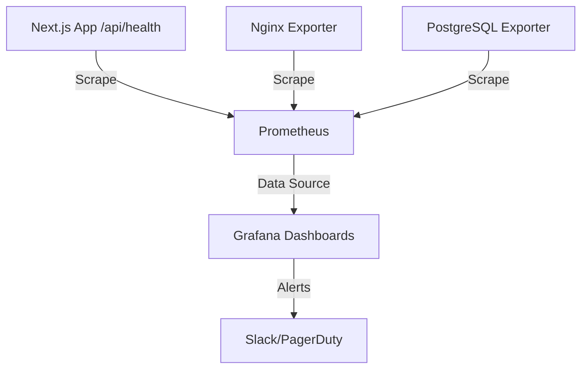

# Monitoring Architecture

DevMarket is designed to integrate with industry-standard observability tools.

## 1. Monitoring Flow

## 2. Components
- **Health Endpoint**: `/api/health` returns JSON payloads detailing DB connection status, uptime, and latency.
- **Prometheus**: Configured via `prometheus.yml` to periodically scrape targets.
- **Grafana**: Visualizes CPU usage, request latency, and HTTP status codes via pre-provisioned dashboards.
