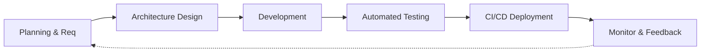

# SDLC Workflow

Software Development Life Cycle (SDLC) defines the structured phases of developing and maintaining DevMarket.

## 1. SDLC Workflow Diagram

## 2. Phases
1. **Planning**: Defining features (News, API Playground) via Agile methodologies.
2. **Design**: Creating UI/UX mockups and ER diagrams.
3. **Development**: Writing code using Next.js, React 19, and Tailwind CSS.
4. **Testing**: Running Vitest unit tests, type-checking, and ESLint.
5. **Deployment**: Triggering Jenkins/GitHub Actions to build Docker images.
6. **Maintenance**: Monitoring logs via Nginx and system metrics via Prometheus.
