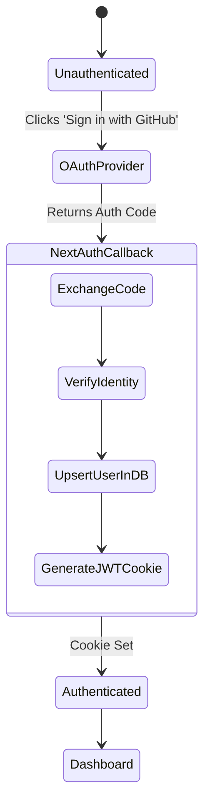

# Security Architecture

DevMarket implements several layers of security to ensure robust protection for users and data.

## 1. Authentication Flow

## 2. Security Headers & Network
- **Nginx Proxy**: Hides internal ports (3000, 5432) from the public internet. Only ports 80/443 are exposed.
- **Stateless JWTs**: Sessions are managed via secure, HttpOnly, encrypted cookies rather than server memory.
- **CORS Protection**: The API playground routes requests through a backend Next.js proxy to bypass browser restrictions safely while protecting API keys.
- **Environment Variables**: Strict separation of concerns. `NEXTAUTH_SECRET` and database credentials are NEVER committed to version control.
